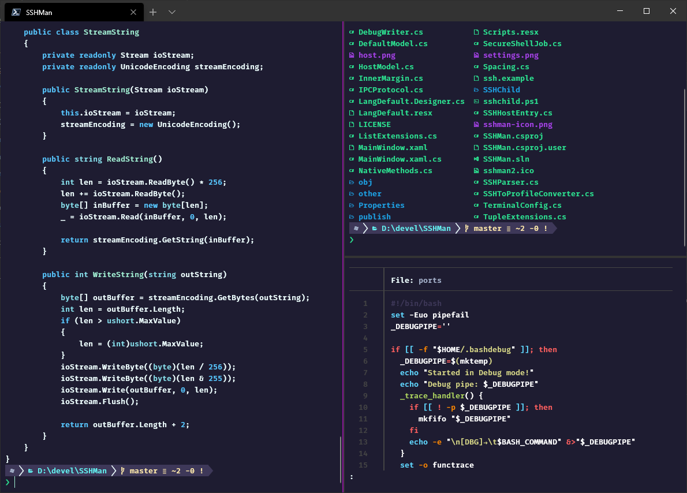

# embark-wt

The Embark Vim theme for the new Windows Terminal



This is a quick port of the [Embark theme](https://github.com/skbolton/embark) based on the [unreleased Kitty settings](https://www.reddit.com/r/neovim/comments/hnscs6/introducing_embark_vim_colorscheme/fxdfz9w?utm_source=share&utm_medium=web2x) I've found on reddit.

Example `settings.json` is included. If already you know where to put a new colorscheme and just want to copy paste it see here:

```json
 {
        "name": "Embark",
        "background": "#1e1c31",
        "foreground": "#EEFFFF",
        "black": "#1e1c31",
        "red": "#F0719B",
        "green": "#A1EFD3",
        "yellow": "#ffe9aa",
        "blue": "#57C7FF",
        "purple": "#C792EA",
        "cyan": "#87DFEB",
        "white": "#F8F8F2",
        "brightBlack": "#3E3859",
        "brightRed": "#F02E6E",
        "brightGreen": "#2CE592",
        "brightYellow": "#ffb378",
        "brightBlue": "#1DA0E2",
        "brightPurple": "#A742EA",
        "brightCyan": "#63f2f1",
        "brightWhite": "#a6b3cc"
}
```

Keep in mind that you have to set `cursorColor` and `selectionBackground` in the profile settings.

```json
          "cursorColor": "#A1EFD3",
          "selectionBackground": "#fbfcfc"
```


